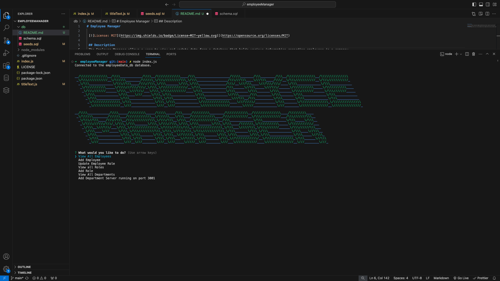
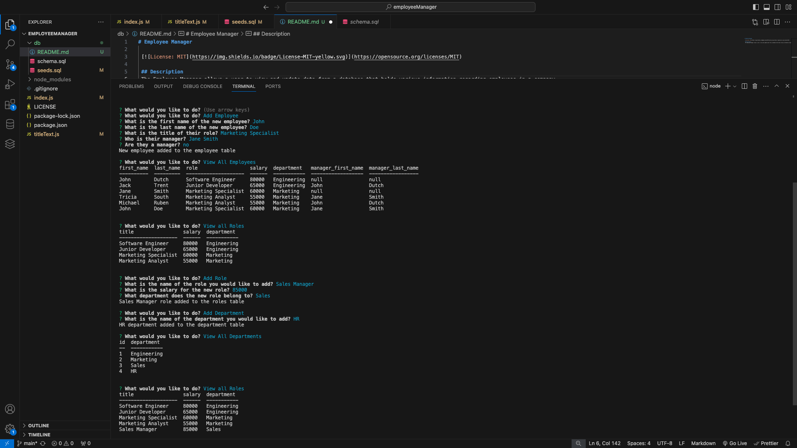

# Employee Manager

 

 ## Description
 The Employee Manager allows a user to view and update data from a database that holds various information regarding employees in a company. All controls are done in CLI making it accessible to any users. The Employee Manager uses Node, Inquirer and MYSQL to run all operations.

  ## Installation 
  Once you have cloned the employee manager repo you will run 'npm i' in your terminal to install all the depandacies required for the manager. 

  ## Usage
  To run the app you will type 'node index.js' into the terminal and the CLI application will begin. You will be greated with a colourful title and a selection of actions that you may choose from using arrow keys and 'enter' to select. The options for actions include 'view all employees', 'Add employee', 'Update Employee Role', 'View all Roles', 'Add Role', 'View all departments' and 'Add department'. When a selection is made you are either given the information you asked to view or prompted to enter information to be added to a table. Once an entry is finished the full list of options returns to the screen if you have any more adjustments you would like to make. 

 Initial Load Screen:
  
 An example of all possible actions performed in ther terminal:
  

[Demo Video](https://drive.google.com/file/d/1bx86gjV3yA_TKYFBm9N-2iRlMHNhCcUj/view)

  ## License
  MIT License

  ## How to Contribute
  Feel free to contact me with any ideas.

  ## Questions
  [Github Profile](https://github.com/garrethil)

  For any further questions you may contact me at this email: garrethildebrandt@gmail.com